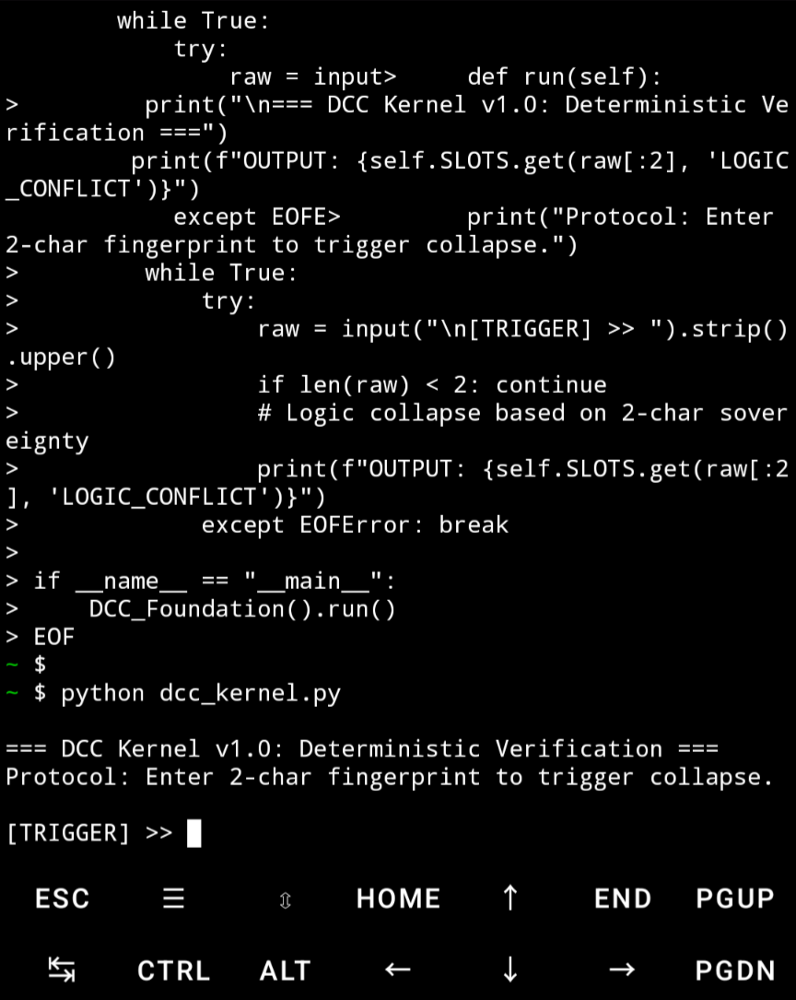
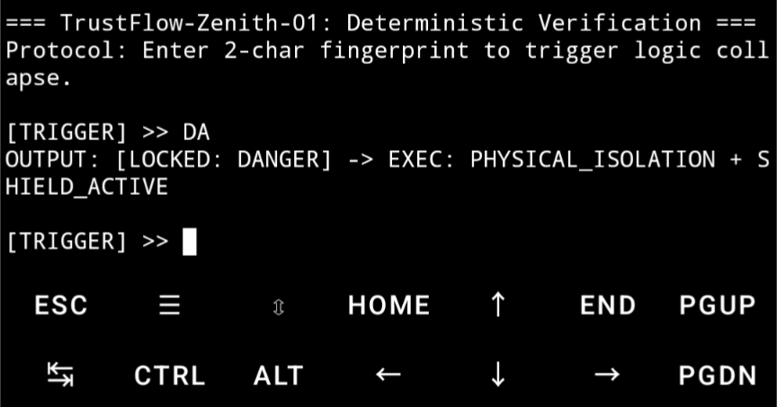
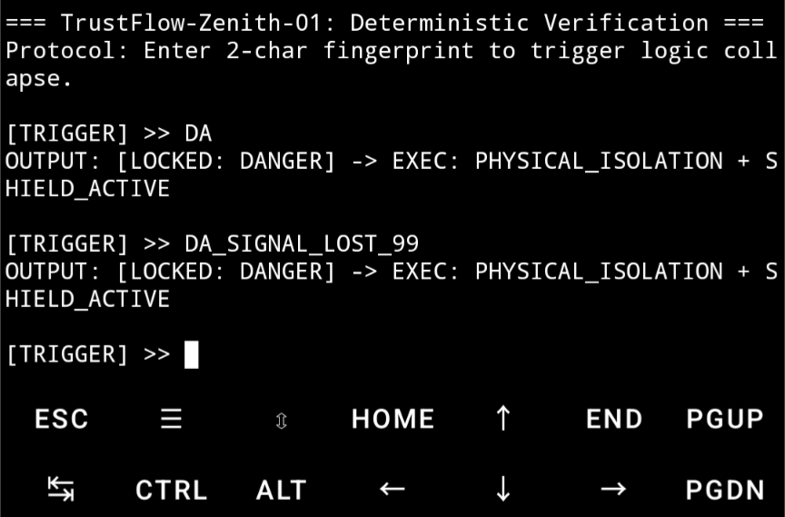
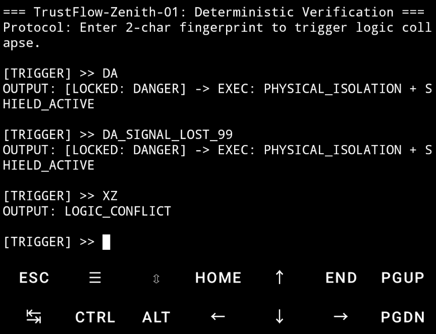

​TrustFlow-Zenith-01 (TFZ-01)

​The Foundation of Deterministic Code Sovereignty

​"The beginning dictates the end. Precision is not an option; it is a physical law."

​🌌 The Zenith Manifesto: Origin Determinism

​Traditional programming is often a fragile process of "guessing and patching." Developers write complex, linear code, hoping it avoids logic drifts and unhandled exceptions.

​TrustFlow-Zenith-01 destroys this uncertainty. We introduce Origin-Locked Architecture (OLA):
​

Source Entanglement: The execution outcome is physically locked at the first 2 characters of input. There is no "middle-ground" for logic to fail.


​Permanent Correction: In this system, "bugs" are physically impossible because erroneous logic is rejected at the source. If the origin is right, the end is inevitable.
​

Complexity Reduction: By defining deterministic logic slots, we turn chaotic software development into a standardized, error-free "mold-casting" process.


​🛠️ Hardcore Verification (0-to-1 Proof)

​As an outsider, you can verify the absolute sovereignty of this architecture in 30 seconds using Termux (Android) or any Python 3 environment.

​1. Deploy the Kernel

​Execute the following to initialize the Zenith-01 Core:

### 1. Deploy the Zenith-01 Core
Run this single block in your terminal to create and initialize the core:

```bash
cat << 'EOF' > z01_core.py
import sys

class Zenith_Core:
    def __init__(self):
        self.SLOTS = {
            "DA": "[LOCKED: DANGER] -> EXEC: PHYSICAL_ISOLATION + SHIELD_ACTIVE",
            "AL": "[LOCKED: ALIVE]  -> EXEC: SYNC_OSCILLATOR + STEADY_STATE",
            "SA": "[LOCKED: SAFE]   -> EXEC: RESTORE_RX + LOW_POWER",
            "ST": "[LOCKED: STOP]   -> EXEC: PERSIST_STATE + HALT_CLOCK"
        }

    def run(self):
        print("\n=== TrustFlow-Zenith-01: Deterministic Verification ===")
        print("Protocol: Enter 2-char fingerprint to trigger logic collapse.")
        while True:
            try:
                raw = input("\n[TRIGGER] >> ").strip().upper()
                if len(raw) < 2: continue
                print(f"OUTPUT: {self.SLOTS.get(raw[:2], 'LOGIC_CONFLICT')}")
            except EOFError: break

if __name__ == "__main__":
    Zenith_Core().run()
EOF

python z01_core.py

```



🧪 Visual Evidence of Determinism

​The following proofs are captured directly from the DCC Execution Environment, demonstrating logic that is not "written," but "predestined."

​Case A: Deterministic Trigger
​


Action: Input fingerprint DA.

​Result: Immediate logic collapse into a secured state. The outcome was locked the moment 'D' was typed.

​Case B: Anti-Noise Resilience



​Action: Input DA_SIGNAL_LOST_99.

​Result: The logic remains locked. Even with extreme suffix interference, the origin dictates the result.

Case C: Collision Protection



​Action: Input undefined inputs (XZ).

​Result: Immediate rejection. Erroneous logic is physically incapable of execution.

​🤝 Call for Logic Architects (1-to-100)

​The 0-to-1 foundation is solidified. We invite the global community to expand this deterministic fabric:

1.​Define New Slots: Propose unique 2-character fingerprints in /slots.

2.​Porting: Port the Zenith-01 Core to Rust, Verilog, or C for hardware integration.

3.​Stress Test: Test stability under extreme Signal-to-Noise Ratio (SNR) conditions.

​"We do not write code to hope. We write code to be certain."
​
Kernel Version: 1.0.0
License: MIT
